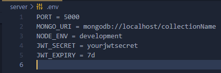

# Crud App

- a simple crud app that allows user to authenticate themselves create tasks and much more fun stuff.

## features

- authentication and authorization with jwt
- creating a task
- updating a task
- deleting a task
- mark task as incomplete or complete

### tools

- Frontend: Reactjs, React-Redux
- Backend : express web framework
- database : Mongodb

### getting started

- clone this repository into your machine
- cd into client directory run `npm install` or `npm i` to install all dependancies i used on the client side, do the same on the server side

- create a dotenv file on the server directory, include the following key value pairs:

- navigate back to client folder run npm start to start client server
- head on to localhost:3000 on your browser enjoy 🎉

- [Taskiit](https://taskiit.netlify.app)
